

<!-- ANIMATED PARTICLE-NETWORK BANNER -->
<!-- Upload banner.svg to your profile repo (e.g. assets/banner.svg), then swap the src below
     for: https://raw.githubusercontent.com/Rituraj2018/Rituraj2018/main/assets/banner.svg -->
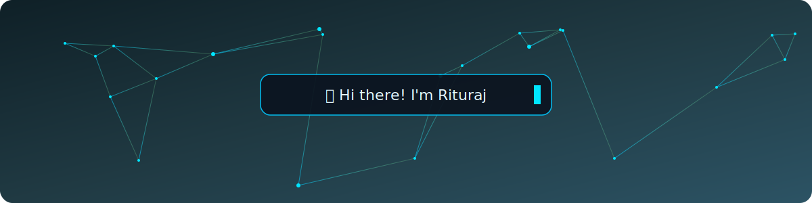

 
<!-- TYPING ANIMATION -->

 

<!-- SOCIAL BADGES -->

  
  
  
  
  
  

<!-- VISITOR COUNTER -->

 

- 🚀 Passionate about turning ideas into fast, scalable full-stack applications
- 🛠️ Specializing in the **MERN Stack** — MongoDB, Express, React, Node.js
- 🧩 A problem solver at heart who enjoys breaking down complex challenges
- 🎨 Loves crafting clean, minimal, and delightful user interfaces
- 📚 Constantly learning new tools and technologies to level up
- 🌱 Currently diving deeper into **TypeScript, Next.js, Docker & System Design**

 

## ⚡ Tech Stack

<table>
  <tr>
    <td align="center" width="14.28%">
      
       
      <b>HTML5</b>
    </td>
    <td align="center" width="14.28%">
      
       
      <b>CSS3</b>
    </td>
    <td align="center" width="14.28%">
      
       
      <b>JavaScript</b>
    </td>
    <td align="center" width="14.28%">
      
       
      <b>TypeScript</b>
    </td>
    <td align="center" width="14.28%">
      
       
      <b>React</b>
    </td>
    <td align="center" width="14.28%">
      
       
      <b>Redux</b>
    </td>
    <td align="center" width="14.28%">
      
       
      <b>Next.js</b>
    </td>
  </tr>
  <tr>
    <td align="center" width="14.28%">
      
       
      <b>Tailwind CSS</b>
    </td>
    <td align="center" width="14.28%">
      
       
      <b>Bootstrap</b>
    </td>
    <td align="center" width="14.28%">
      
       
      <b>Node.js</b>
    </td>
    <td align="center" width="14.28%">
      
       
      <b>Express.js</b>
    </td>
    <td align="center" width="14.28%">
      
       
      <b>Java</b>
    </td>
    <td align="center" width="14.28%">
      
       
      <b>Socket.IO</b>
    </td>
    <td align="center" width="14.28%">
      
       
      <b>REST API</b>
    </td>
  </tr>
  <tr>
    <td align="center" width="14.28%">
      
       
      <b>JWT</b>
    </td>
    <td align="center" width="14.28%">
      
       
      <b>MongoDB</b>
    </td>
    <td align="center" width="14.28%">
      
       
      <b>MongoDB Compass</b>
    </td>
    <td align="center" width="14.28%">
      
       
      <b>MySQL</b>
    </td>
    <td align="center" width="14.28%">
      
       
      <b>PostgreSQL</b>
    </td>
    <td align="center" width="14.28%">
      
       
      <b>Docker</b>
    </td>
    <td align="center" width="14.28%">
      
       
      <b>Nginx</b>
    </td>
  </tr>
  <tr>
    <td align="center" width="14.28%">
      
       
      <b>Git</b>
    </td>
    <td align="center" width="14.28%">
      
       
      <b>GitHub</b>
    </td>
    <td align="center" width="14.28%">
      
       
      <b>VS Code</b>
    </td>
    <td align="center" width="14.28%">
      
       
      <b>Postman</b>
    </td>
    <td align="center" width="14.28%">
      
       
      <b>Cloudinary</b>
    </td>
    <td align="center" width="14.28%">
      
       
      <b>Render</b>
    </td>
    <td align="center" width="14.28%">
      
       
      <b>Vercel</b>
    </td>
  </tr>
</table>

 

## 📊 GitHub Statistics

  
  

  

  

 

## 🚀 Featured Projects

<table>
<tr>
<td width="50%">

### 🛒 E-Mart
Full Stack MERN Ecommerce Website with cart, authentication, payments, and an admin dashboard.

**Stack:** React · Redux · Node.js · Express · MongoDB · JWT · Cloudinary

</td>
<td width="50%">

### 💬 Chat Application
Real-time chat app with instant messaging and user presence.

**Stack:** React · Node.js · Express · MongoDB · Socket.io

</td>
</tr>
<tr>
<td width="50%">

### ✅ Task Manager
Full-stack task and productivity manager with authentication and drag-and-drop boards.

**Stack:** React · Node.js · Express · MongoDB · JWT

</td>
<td width="50%">

### 🎬 Movie App
Movie discovery app with search, trailers, and personalized watchlists.

**Stack:** React · REST API · Tailwind CSS

</td>
</tr>
</table>

 

## 💭 Random Dev Quote

  

 

## 🎯 Fun Facts

| ☕ Coffee | 💻 Coding | 📚 Learning | 🎵 Music |
|:---:|:---:|:---:|:---:|
| Fueled by coffee, one commit at a time | Turning ☕ into 💻 daily | Always exploring something new | Codes better with a good playlist on |

 

## 💖 Support My Work

  
  

 

### Thanks for visiting my profile ❤️

